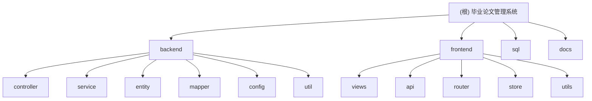

# 毕业论文管理系统 - 精简版

## 变更记录 (Changelog)

| 日期 | 版本 | 说明 |
|------|------|------|
| 2026-01-30 | 1.0.0 | 初始化项目文档，完成架构扫描 |

---

## 项目愿景

基于 Spring Boot 3.x + Vue 3 的单体架构论文管理系统，适用于个人开发和校园低并发场景。核心功能包括用户管理、论文上传、版本控制、批改流程和版本对比。

---

## 架构总览

### 技术栈

**后端**

- Spring Boot 3.2.1
- MyBatis-Plus 3.5.5
- Spring Security + JWT 0.12.5
- MySQL 8.0
- Redis 7.0
- Java Diff Utils 4.12

**前端**

- Vue 3.4
- Vite 5.0
- Element Plus 2.5
- Pinia (状态管理)
- Vue Router 4
- Axios

**部署**

- Docker Compose
- Nginx (前端服务)

### 架构特点

- 单体架构：简化部署，降低运维复杂度
- 无状态认证：JWT 令牌，无需 Session 管理
- 容器化部署：Docker Compose 一键启动
- 逻辑删除：所有实体均支持软删除

---

## 模块结构图



---

## 模块索引

| 模块路径 | 语言 | 职责 | 入口文件 | 文档链接 |
|---------|------|------|---------|---------|
| backend | Java 17 | 后端服务，提供 RESTful API | ThesisApplication.java | [backend/CLAUDE.md](./backend/CLAUDE.md) |
| frontend | JavaScript/Vue 3 | 前端 SPA，用户界面 | main.js | [frontend/CLAUDE.md](./frontend/CLAUDE.md) |
| sql | SQL | 数据库初始化脚本 | init.sql | - |
| docs | Markdown | 项目设计文档 | - | - |

---

## 运行与开发

### 使用 Docker Compose（推荐）

```bash
# 启动所有服务
docker-compose up -d

# 查看日志
docker-compose logs -f

# 停止服务
docker-compose down
```

访问地址：

- 前端 (Docker): <http://localhost:8888>
- 后端 API (Docker): <http://localhost:8080/api>
- 前端 (本地开发): <http://localhost:3000>

### 本地开发

**后端**

```bash
cd backend

# 安装 MySQL 8.0 和 Redis 7.0
# 执行 sql/init.sql 初始化数据库

# 修改 application.yml 中的数据库配置

# 运行
mvn spring-boot:run
```

**前端**

```bash
cd frontend

# 安装依赖
npm install

# 开发模式
npm run dev

# 构建生产版本
npm run build
```

---

## 测试策略

### 当前状态

- 已配置 Spring Boot Test 依赖
- 未发现单元测试或集成测试

### 推荐测试策略

1. **单元测试**：Service 层使用 JUnit 5 + Mockito
2. **集成测试**：Controller 层使用 MockMvc
3. **前端测试**：建议引入 Vitest + Vue Test Utils
4. **E2E 测试**：建议使用 Playwright 或 Cypress

---

## 编码规范

### 后端规范

- **命名**：驼峰命名法，类名大写开头，方法名小写开头
- **注释**：所有 public 方法需添加 JavaDoc
- **异常处理**：统一使用 Result 包装类返回
- **日志**：使用 SLF4J，按级别输出（INFO/WARN/ERROR）

### 前端规范

- **命名**：组件大驼峰，文件名与组件名一致
- **状态管理**：Pinia 统一管理全局状态
- **API 调用**：集中在 api/ 目录，使用封装的 request.js
- **样式**：优先使用 Element Plus 组件，避免重复造轮子

### 数据库规范

- **表名**：小写 + 下划线，统一前缀 `t_`
- **字段名**：小写 + 下划线
- **索引**：外键字段必须添加索引
- **逻辑删除**：所有表包含 `deleted` 字段

---

## AI 使用指引

### 代码生成建议

1. **Controller 层**：指定 HTTP 方法、路径、请求/响应格式
2. **Service 层**：明确业务逻辑、事务边界、异常处理
3. **Mapper 层**：使用 MyBatis-Plus BaseMapper，复杂查询使用 XML
4. **Vue 组件**：说明组件职责、props、事件、状态依赖

### 代码审查要点

- JWT 密钥安全性（生产环境必须更换）
- 文件上传大小限制（当前 50MB）
- SQL 注入防护（MyBatis-Plus 参数化查询）
- XSS 防护（前端输入验证 + 后端过滤）

### 重构建议

1. 添加全局异常处理器（@ControllerAdvice）
2. 引入缓存层（Redis）优化论文列表查询
3. 文件存储迁移到对象存储（MinIO/S3）
4. 添加操作日志（AOP 切面）

---

## 数据库设计

### 核心表结构

- **t_user**: 用户表（id, username, password_hash, role, email）
- **t_thesis**: 论文表（id, student_id, title, status, current_version）
- **t_thesis_version**: 版本表（id, thesis_id, version_num, file_path, content_hash）
- **t_review**: 批改表（id, version_id, teacher_id, comment, score, status）

### 关键关系

- user -> thesis (1:N, 一个学生多篇论文)
- thesis -> thesis_version (1:N, 一篇论文多个版本)
- thesis_version -> review (1:N, 一个版本多次批改)
- user(teacher) -> review (1:N, 一个教师多次批改)

---

## 默认账号

系统初始化后会创建以下测试账号（密码均为 `admin123`）：

- 管理员: `admin`
- 学生: `student1`
- 教师: `teacher1`

---

## 主要 API 端点

### 认证接口

- `POST /api/auth/register` - 用户注册
- `POST /api/auth/login` - 用户登录

### 论文接口

- `POST /api/thesis/create` - 创建论文
- `POST /api/thesis/{id}/upload` - 上传版本
- `GET /api/thesis/my` - 查询我的论文
- `GET /api/thesis/{id}/versions` - 获取版本列表
- `GET /api/thesis/version/{id}/download` - 下载版本

### 批改接口

- `POST /api/review/create` - 创建批改记录
- `GET /api/review/version/{id}` - 获取版本批改
- `GET /api/review/my` - 查询我的批改记录

### 对比接口

- `GET /api/diff/compare?version1Id={id1}&version2Id={id2}` - 版本对比

---

## 开发路线图

参考 [docs/ai_plans/2026-01-09_thesis_system_plan_lite.md](./docs/ai_plans/2026-01-09_thesis_system_plan_lite.md)

| 阶段 | 周期 | 任务 |
|------|------|------|
| Phase 1 | Week 1 | Spring Boot + JWT + 用户模块 |
| Phase 2 | Week 2 | 论文上传下载 + 版本管理 |
| Phase 3 | Week 3 | 批改流程 + 版本对比 |
| Phase 4 | Week 4 | 前端完善 + Docker 部署 |

---

## 许可证

MIT License
